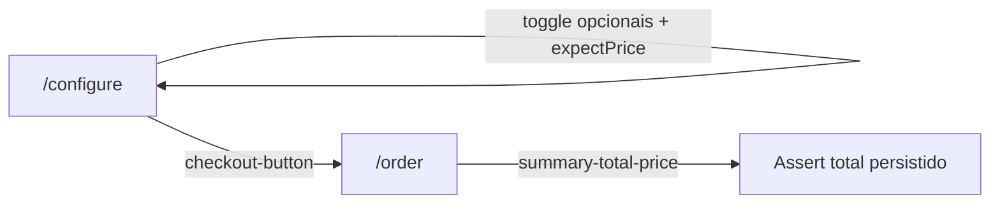

# Plano: CT03 com fixtures e actions

## Referência do caso ([docs/tests/test-cases.md](docs/tests/test-cases.md))

- **Pré-condição:** configurador em `/configure`, sem opcionais, preço **R$ 40.000,00** (já coberto pelo `beforeEach` que chama `app.configurator.open()` em [playwright/e2e/configurator.spec.ts](playwright/e2e/configurator.spec.ts)).
- **Passos 1–3:** alternar **Precision Park** (+R$ 5.500) e **Flux Capacitor** (+R$ 5.000), validar totais **R$ 45.500,00** e **R$ 50.500,00**, desmarcar ambos e voltar a **R$ 40.000,00**.
- **Passo 4:** botão **Monte o Seu** → rota **`/order`** com valores persistidos (após o passo 3, o estado esperado no checkout é total base, sem opcionais).

## O que o app já oferece (sem mudança de produto necessária)

Em [src/components/configurator/ConfigPanel.tsx](src/components/configurator/ConfigPanel.tsx):

- Checkboxes: `data-testid="opt-precision-park"` e `data-testid="opt-flux-capacitor"`.
- Preço: `data-testid="total-price"` (já usado por `expectPrice`).
- CTA: `data-testid="checkout-button"` (texto “Monte o Seu”).

Em [src/pages/Order.tsx](src/pages/Order.tsx):

- Total no resumo: `data-testid="summary-total-price"` (modo à vista padrão = `totalPrice`).

## Padrão atual a manter

- Factory `createXActions(page)` retornando objeto de métodos assíncronos ([playwright/support/actions/configuratorActions.ts](playwright/support/actions/configuratorActions.ts), [playwright/support/actions/orderLookupActions.ts](playwright/support/actions/orderLookupActions.ts)).
- Fixture `app` montado em [playwright/support/fixtures.ts](playwright/support/fixtures.ts) com `base.extend`.

## Implementação proposta

### 1. Estender `createConfiguratorActions`

Arquivo: [playwright/support/actions/configuratorActions.ts](playwright/support/actions/configuratorActions.ts).

- **`togglePrecisionPark()`** / **`toggleFluxCapacitor()`** (ou um único **`toggleOptional(id: 'precision-park' | 'flux-capacitor')`** mapeando para os `testId` acima): `click()` no elemento com `getByTestId(...)`. Alinha-se a métodos semânticos como `selectColor` / `selectWheels`.
- **`proceedToCheckout()`**: clicar em `getByTestId('checkout-button')` e aguardar navegação para `/order` (por exemplo `await expect(page).toHaveURL(/\\/order/)` ou `page.waitForURL`).

Reutilizar **`expectPrice`** existente para os quatro asserts de preço no configurador.

### 2. Novo arquivo de actions para a página de pedido (checkout)

Criar algo como **`playwright/support/actions/checkoutActions.ts`** (nome coerente com `checkout-button` e com o documento de testes que fala em “Checkout”).

- **`expectLoaded()`** (opcional mas útil): garantir que a página de pedido montou (ex.: heading “Checkout” ou outro marcador estável já presente em `Order.tsx` — ajustar ao que for mais confiável após leitura rápida do topo da página).
- **`expectSummaryTotal(price: string)`**: `getByTestId('summary-total-price')` + `toHaveText(price)` — espelha `expectPrice` do configurador.
- Opcional para reforçar “valores persistidos” após o fluxo do CT03: **`expectOptionalNotListed(name: string)`** com `expect(page.getByRole('listitem').filter({ hasText: name })).toHaveCount(0)` ou equivalente, já que opcionais aparecem como `<li>` no resumo ([Order.tsx](src/pages/Order.tsx) ~499–521).

Manter o arquivo enxuto; CT04+ podem acrescentar preenchimento de formulário no mesmo módulo depois.

### 3. Atualizar o fixture `app`

Arquivo: [playwright/support/fixtures.ts](playwright/support/fixtures.ts).

- Importar `createCheckoutActions`.
- Estender o tipo `App` com `checkout: ReturnType<typeof createCheckoutActions>`.
- Instanciar no `extend`: `checkout: createCheckoutActions(page)`.

### 4. Novo teste E2E no spec do configurador

Arquivo: [playwright/e2e/configurator.spec.ts](playwright/e2e/configurator.spec.ts).

- Um `test` (ou sub-`describe` “CT03”) que:
  1. `expectPrice('R$ 40.000,00')`
  2. toggle Precision Park → `expectPrice('R$ 45.500,00')`
  3. toggle Flux Capacitor → `expectPrice('R$ 50.500,00')`
  4. desmarcar ambos (dois toggles) → `expectPrice('R$ 40.000,00')`
  5. `proceedToCheckout()` → `app.checkout.expectSummaryTotal('R$ 40.000,00')` (+ asserts opcionais de ausência dos opcionais no resumo)

Títulos em português, no mesmo tom dos testes existentes.

## Diagrama do fluxo

## Riscos / notas

- **Checkbox Radix:** se `click` no `data-testid` falhar por sobreposição, usar `force: true` ou focar no `role=checkbox` associado ao label — os `testId` estão no componente `Checkbox` e costumam ser suficientes.
- **Paralelismo:** o store é no cliente; cada teste usa um contexto de navegador isolado, alinhado ao uso atual do configurador.

Nenhuma alteração em `docs/tests/test-cases.md` é necessária para implementar o CT03.
